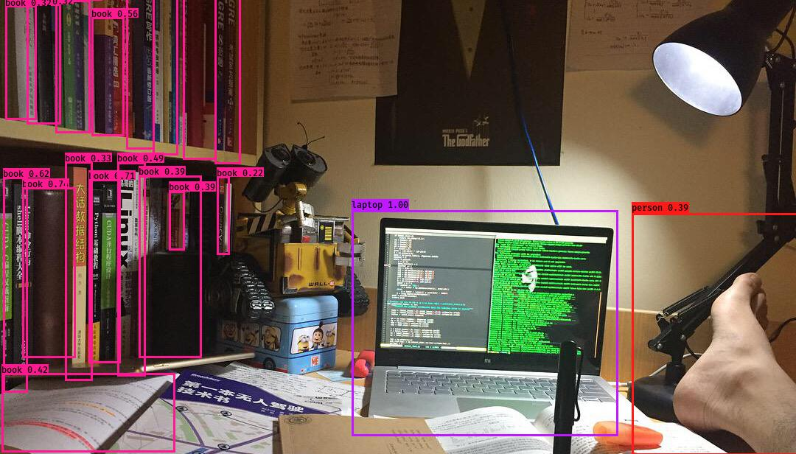
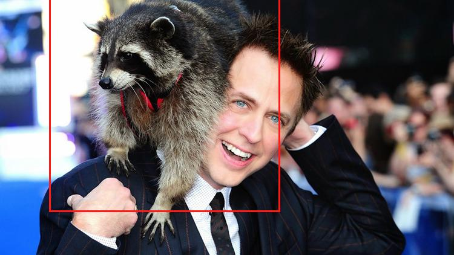
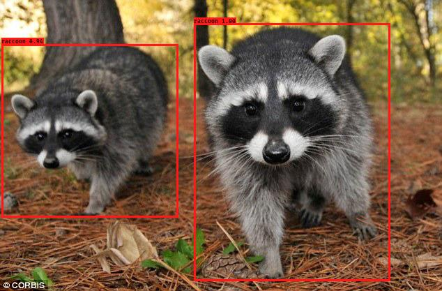

## part 1. Introduction

Implementation of YOLO v3 object detector in Tensorflow (TF-Slim). This repository  is inspired by [Paweł Kapica](https://github.com/mystic123). The full details are in [this paper](https://pjreddie.com/media/files/papers/YOLOv3.pdf).  In this project we cover several segments as follows:<br>
- [x] [YOLO v3 architecture](https://github.com/YunYang1994/tensorflow-yolov3/blob/master/core/yolov3.py)
- [x] Weights converter (util for exporting loaded COCO weights as TF checkpoint)
- [x] Basic working demo
- [x] Non max suppression on the both `GPU` and `CPU` is supported
- [x] Training pipeline
- [x] Compute COCO mAP

YOLO paper is quick hard to understand, along side that paper. This repo enables you to have a quick understanding of YOLO Algorithmn.


## part 2. Quick start
1. Clone this file
```bashrc
$ git clone https://github.com/YunYang1994/tensorflow-yolov3.git
```
2.  You are supposed  to install some dependencies before getting out hands with these codes.
```bashrc
$ cd tensorflow-yolov3
$ pip install -r ./docs/requirements.txt
```
3. Exporting loaded COCO weights as TF checkpoint(`yolov3.ckpt`) and frozen graph (`yolov3_gpu_nms.pb`) . If you don't have [yolov3.weights](https://github.com/YunYang1994/tensorflow-yolov3/releases/download/v1.0/yolov3.weights). Download and put it in the dir `./checkpoint`
```bashrc
$ python convert_weight.py --convert
```
4. Put your template image under ./data/original_template/ to generate training data, edit the file ./data/train/train.names to include all the names of classes. Each line is a class. Run the script
```bashrc
$ python pipeline_generateData.py
```
5. Train the model
```bashrc
$ python pipeline_train.py
```
6. Test the model
```
$ python video_demo.py # if use camera, set video_path = 0
```

## part 3. Train on your own dataset
Three files are required as follows:

- `dataset.txt`:

```
xxx/xxx.jpg 18.19 6.32 424.13 421.83 20 323.86 2.65 640.0 421.94 20
xxx/xxx.jpg 55.38 132.63 519.84 380.4 16
# image_path x_min y_min x_max y_max class_id  x_min y_min ... class_id
```
- `anchors.txt`

```
0.10,0.13, 0.16,0.30, 0.33,0.23, 0.40,0.61, 0.62,0.45, 0.69,0.59, 0.76,0.60,  0.86,0.68,  0.91,0.76
```

- `class.names`

```
person
bicycle
car
...
toothbrush
```


#### how to test and evaluate it ?
```
$ python convert_weight.py -cf ./checkpoint/yolov3.ckpt-2500 -nc 1 -ap ./data/raccoon_anchors.txt --freeze
$ python quick_test.py
$ python evaluate.py
```
if you are still unfamiliar with training pipline, you can join [here](https://github.com/YunYang1994/tensorflow-yolov3/issues/39) to discuss with us.

|raccoon-181.jpg|raccoon-55.jpg|
|---|:---:|
|||
